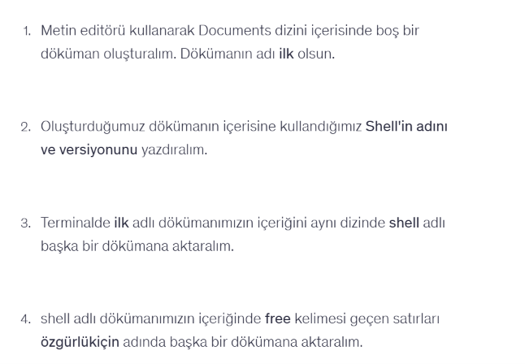

# Linux Shell Exercises 🐧

This repository contains basic Linux shell exercises that I completed while practicing command-line operations on Ubuntu.

## 📌 Exercise

In this exercise, I practiced creating files, displaying shell information, redirecting command output, and filtering text using Linux terminal commands.

## 📝 Questions

## 💻 Solution

## 🔧 Commands Practiced

- `cd` – Navigate between directories
- `touch` – Create an empty file
- `echo` – Display shell information and write text
- `bash --version` – Display the Bash version
- `cat` – Display and redirect file contents
- `grep` – Search for matching text
- `>` – Redirect output to a file
- `>>` – Append output to a file

## 🖥️ Environment

- Ubuntu Linux
- Bash Shell
- Oracle VirtualBox

## 🎯 Purpose

The purpose of this exercise was to gain hands-on experience with basic Linux shell commands, file operations, output redirection, and text filtering.
